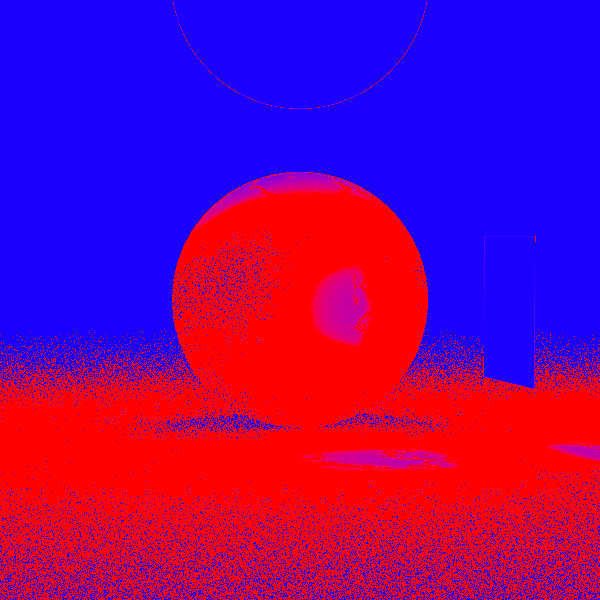

# Ray Tracing in One Weekend / Week

This is a C++ implementation of the methods described in the books "Ray Tracing in One Weekend" and "Ray Tracing: The Next Week" by Peter Shirley.

It has all the functionality from the books, with the addition of a few features:

- Extra surfaces, including triangles, ellipsoids and discs.
- New classes (Sampler, Renderer, PixelSampler, PixelRenderer) add abstraction to the camera, allowing for the next few features.
- Adaptive ray sampling.
- Getting diagnostic images from the camera (i.e. the sampling density image).
- Multithreading over pixels for increased performance.
- Simple command line interface allowing for the scene to be specified and a few settings to be changed.
- Output to multiple file formats through a file or stdout.

## Examples

In the following examples, the scene is rendered with 10000 samples per pixel, and the adaptive sampling is enabled. The second image is the sampling density image, which shows the number of samples taken per pixel. Red is high density, blue is low density.

### In One Weekend


### Lighting




### Cornell Box


### One Week


## Building

Using CMake:

```bash
mkdir build
cd build
cmake ..
cmake --build . --config Release
```

and then run the executable from the build directory:

```bash
./build/raytracer
```

Or using Makefile:

```bash
make
```

and then run the executable from the build directory:

```bash
./build/release/raytracer
```

You might have to change the CXX variable in the Makefile to your compiler.

## Running

```bash
% ./raytracer -h
Usage: .raytracer [options] <scene>
Options:
  -h              Show this help message
  -o <file>       Send output to <file>.ext instead of stdout.
  -f <format>     Output format (PPM or PNG) (default: PPM)
  -w <width>      Image width in pixels (default: 400)
  -r <ratio>      Aspect ratio (width/height) (default: 1.77778)
  -s <samples>    Samples per pixel (default: 100)
  -a              Enable adaptive sampling
    -b <samples>  Burn-in samples (default: 64)
    -c <samples>  Check every <samples> samples (default: 64)
    -t <tol>      Tolerance for adaptive sampling (default: 0.01)
    -d            Output sampling density image. -o must be specified.
```
